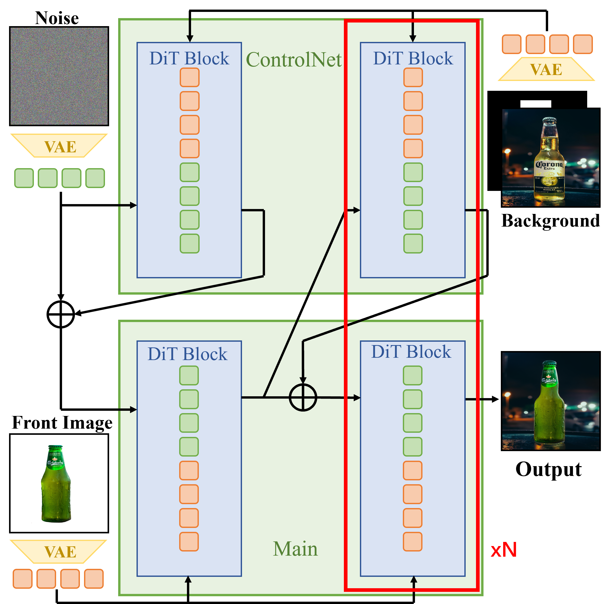

# FLUX-Kontext-ControlNet-Inpainting

<div align="center">

[](https://www.python.org/)
[](https://pytorch.org/)
[](https://github.com/huggingface/diffusers)
[](https://huggingface.co/black-forest-labs/FLUX.1-dev/blob/main/LICENSE.md)

</div>

<br/>

This repository adapts [FLUX.1-dev-Controlnet-Inpainting](https://github.com/alimama-creative/FLUX-Controlnet-Inpainting) to **FLUX.1-Kontext**, combining ControlNet-guided inpainting with Kontext reference-image conditioning for identity-preserving object compositing.

<p align="center">
  
</p>

## Overview

Given a background image, a mask, and a reference foreground image, the model inpaints the masked region while preserving the identity and appearance of the reference object.

The core innovation is a **dual-latent architecture**: the Transformer accepts `concat([noise_latents, kontext_latents])` as input, with a `noise_length` parameter that restricts ControlNet residual injection to only the noise portion — leaving the Kontext reference latents intact for context propagation through the denoising process.

## Model Cards

| Component | Model | Notes |
|-----------|-------|-------|
| Base | [FLUX.1-Kontext-dev](https://huggingface.co/black-forest-labs/FLUX.1-Kontext-dev) | Kontext-enabled DiT backbone |
| ControlNet | [FLUX.1-dev-Controlnet-Inpainting-Beta](https://huggingface.co/alimama-creative/FLUX.1-dev-Controlnet-Inpainting-Beta) | Trained on 12M images at 1024×1024 |
| LoRA | rank=8, alpha=8 | Q/K/V/Out attention projections |

- Recommended `controlnet_conditioning_scale`: **0.9–1.0**
- Recommended resolution: **1024×1024** (other sizes yield suboptimal results)

## Quick Start

### Installation

```bash
pip install diffusers==0.30.2
```

### Inference

```python
import torch
from diffusers.utils import load_image
from controlnet_flux import FluxControlNetModel
from transformer_flux_kontext import FluxTransformer2DModel
from pipeline_kontext_flux_controlnet_inpaint import FluxControlNetInpaintingPipeline

# Build pipeline
controlnet = FluxControlNetModel.from_pretrained(
    "path/to/FLUX.1-dev-Controlnet-Inpainting-Beta",
    torch_dtype=torch.bfloat16
)
transformer = FluxTransformer2DModel.from_pretrained(
    "path/to/FLUX.1-Kontext-dev",
    subfolder="transformer", torch_dtype=torch.bfloat16
)
pipe = FluxControlNetInpaintingPipeline.from_pretrained(
    "path/to/FLUX.1-Kontext-dev",
    controlnet=controlnet,
    transformer=transformer,
    torch_dtype=torch.bfloat16
).to("cuda")

# Inpaint with Kontext reference
result = pipe(
    kontext_image=front_image,          # Foreground reference (white background)
    prompt="A puppy is sitting next to a bear plushie.",
    control_image=background_image,     # Background image
    control_mask=mask,                  # Inpaint region mask
    controlnet_conditioning_scale=0.9,
    guidance_scale=3.5,
    true_guidance_scale=1.0,           # Beta: 1.0, Alpha: 3.5
    num_inference_steps=28,
).images[0]

result.save("output.png")
```

### Inference with LoRA

```python
pipe.load_lora_weights("path/to/lora_checkpoint/step_12000")

# Then call pipe(...) as above
```

### Batch Generation

See `FLUX-Controlnet-Inpainting/main_lora.py` for a batch generation example with multiple seeds:

```bash
cd FLUX-Controlnet-Inpainting
python main_lora.py   # Edit paths and seeds in the script first
```

## Architecture

```
                        ┌──────────────────┐
                        │   Control Image  │
                        │  (background +   │
                        │   mask)          │
                        └────────┬─────────┘
                                 │
                        ┌────────▼─────────┐
                        │ prepare_image_   │
                        │ with_mask()      │
                        │ → packed cond    │
                        └────────┬─────────┘
                                 │
  ┌──────────────────┐          │
  │   Kontext Image  │          │
  │  (foreground     │          │
  │   reference,     │          │
  │   white bg)      │          │
  └────────┬─────────┘          │
           │                    │
  ┌────────▼─────────┐  ┌──────▼───────┐  ┌─────────────────┐
  │ prepare_latents  │  │  ControlNet  │  │  encode_prompt  │
  │ → kontext_latents│  │  → residuals │  │  (T5 + CLIP)    │
  │ → noise_latents  │  └──────┬───────┘  └────────┬────────┘
  └────────┬─────────┘         │                    │
           │                   │                    │
           └───────────────────┼────────────────────┘
                               │
                    ┌──────────▼──────────┐
                    │   Transformer       │
                    │  (Kontext variant)  │
                    │                     │
                    │  input = concat(    │
                    │    noise_latents,   │
                    │    kontext_latents  │
                    │  )                  │
                    │                     │
                    │  ControlNet resid   │
                    │  injected only at   │
                    │  [:noise_length]    │
                    └──────────┬──────────┘
                               │
                        ┌──────▼───────┐
                        │  VAE Decode  │
                        │  → output    │
                        └──────────────┘
```

The Transformer input is the concatenation `[noise_latents | kontext_latents]`. ControlNet residual outputs are injected only into the noise portion via `hidden_states[:, :noise_length, ...]`. The Kontext reference portion passes through unchanged, providing contextual information without being perturbed by the inpainting control signal.

## Repository Structure

```
FLUX-Controlnet-Inpainting/
├── controlnet_flux.py                          # FluxControlNetModel definition
├── transformer_flux.py                         # Base FluxTransformer2DModel
├── transformer_flux_kontext.py                 # Kontext-extended Transformer
├── pipeline_kontext_flux_controlnet_inpaint.py # Main inference pipeline
├── pipeline_flux_controlnet_inpaint.py         # Original pipeline (no Kontext)
├── main.py                                     # Basic inference example
├── main_lora.py                                # LoRA batch inference example
├── images/                                     # Sample images from upstream
└── readme.md                                   # Upstream README

figure/
└── image1.png                                  # Architecture diagram
```

## Key Design: noise_length

```
Transformer input:  [noise_latents | kontext_latents]
                              ▲
                              │
              ControlNet residuals injected
              only into this portion:
              hidden_states[:, :noise_length, ...]
```

This ensures the Kontext reference latents act as pure context — they flow through the Transformer and influence attention, but are never directly modified by the ControlNet inpainting signal.

## License

Model weights are subject to the [FLUX.1 [dev] Non-Commercial License](https://huggingface.co/black-forest-labs/FLUX.1-dev/blob/main/LICENSE.md).

## Acknowledgements

<div align="center">

<a href="https://github.com/alimama-creative/FLUX-Controlnet-Inpainting">
  
</a>
<a href="https://huggingface.co/black-forest-labs/FLUX.1-Kontext-dev">
  
</a>
<a href="https://huggingface.co/alimama-creative/FLUX.1-dev-Controlnet-Inpainting-Beta">
  
</a>

</div>

<br/>

Built on [AlimamaCreative/FLUX-Controlnet-Inpainting](https://github.com/alimama-creative/FLUX-Controlnet-Inpainting).

<div align="center">
  
</div>
